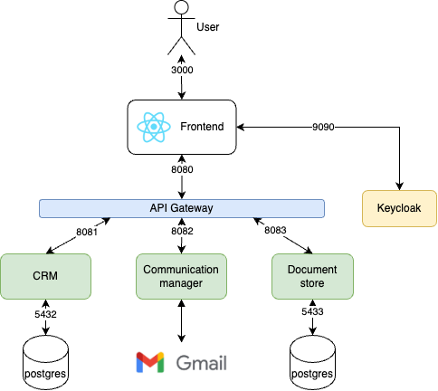

# LAB5
Web Applications 2 course - Group 20

## Architecture
The system is composed of a frontend in (React + Vite + TS) and a backend accessible through the Spring Cloud Gateway. The backend is composed of a set of microservices that are accessible through the gateway. The frontend is responsible for rendering the UI and making requests to the backend microservices.



The repository is organized as follows:
- `api_gateway/`: contains the api gateway code
- `com_manager/`: contains the git submodule for the communication manager (LAB 4)
- `crm/`: contains the git submodule for the CRM (LAB 3)
- `document_store/`: contains the git submodule for the document manager (LAB 1)
- `frontend/`: contains the frontend code (React + Vite + TS)

## How to run the system
The system can be run through intelliJ IDEA IDE using the configuration built by us or by running each spring module individually.
We tried to configure the system to run with docker-compose (there is also the commented code on the docker-compose.yml) but we were not able to make it work and since it was not requested for this lab we opted for the local Spring execution.

There are also 3 containers:
- `keycloak`: the identity provider
- `postgres_ds`: the Postgres database for the document store
- `postgres_crm`: the Postgres database for the CRM

## How to access the system
To access the keycloak admin console, go to `http://localhost:9090` and login with the credentials user:`admin` and password:`password`.
There are already users created in the system:

- **guest**: 
  - `email`: guest@guest.com
  - `password`: guest
  - `description`: Can access all GET endpoints

- **operator**:
  - `email`: operator@operator.com
  - `password`: operator
  - `description`: Can access all GET, POST and PUT endpoints

- **manager**:
  - `email`: manager@manager.com
  - `password`: manager
  - `description`: Can access all endpoints

Here how to access each resource server through the gateway:

- `crm`: http://localhost:8080/API/v1/crm/**
- `com_manager`: http://localhost:8080/API/v1/com_manager/**
- `document_store`: http://localhost:8080/API/v1/document_store/**


## Important notes

The GMAIL api is in test mode, the refresh token expires in 7 days. The new token was generated on 13 of June. If the token expires, the 
com_manager microservice will crash on startup providing the following errorL

```
POST https://oauth2.googleapis.com/token
{
  "error" : "invalid_grant",
  "error_description" : "Token has been expired or revoked."
}
```

To fix this, the application need a new refresh token of the GMAIL API.