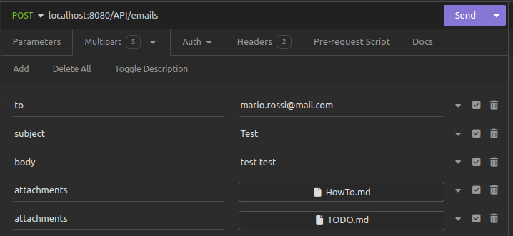

# LAB4
Web Applications 2 course - Group 20

## Documentation

> The documentation is provided by the Swagger UI.
>
> - [Swagger UI](http://localhost:8080/swagger-ui/index.html#/)
> - [API Documentation](http://localhost:8080/v3/api-docs)

the environment variables are in the `.env.template` file, modify the file and rename it to `.env` in order to make the system work.

## How to run the docker image
Create the image with the following command
``` bash
./gradlew bootBuildImage
```
Then execute this command on the `docker-compose.yml` file
``` bash
docker compose up --build
```

## How to run the application

To run the application you need:

- A running instance of CRM microservice, it was modified after the Lab03 delivery to integrate the email from gmail. The repository is [here](https://github.com/polito-WAII-2024/lab3-g20.git)
- A running instance of Document Store microservice, it was modified after the Lab01 delivery to integrate the email from gmail. The repository is [here](https://github.com/polito-WAII-2024/lab1-g20.git)

The ports used by the services are:

- Communication Manager (this app): `8080`
- CRM: `8081`
- Document Store: `8082`

The environment variables are in the `.env.template` file, modify the file and rename it to `.env` in order to make the system work.

The instances of the services can be run by opening the three project with intellij and running them.

### Send an email

To send an email you need to make a POST request to the endpoint `/emails` with a `multipart/form-data` body with the following fields:

- `to`: The email address of the recipient (must be a valid email address)
- `subject`: The subject of the email (can be empty)
- `body`: The text of the email (can be empty)
- `attachments`: The attachment file (optional)
- `attachments`: The attachment file (optional)

#### Example (Insomnia)




### Retrieve emails

The service start to retrieve emails from the email account when the application is started. 

To test:

- send an email to `consegnamoentrole2359@gmail.com`
- the service will retrieve the email and log the elaboration process in the console
- by making a GET request to `http://localhost:8081/messages` you can see the email saved in the CRM service
- by making a GET request to `http://localhost:8082/documents/{id}` you can see the attachments saved in the Document Store service (replace `{id}` with the id of the attachment, you can find it in the CRM service)